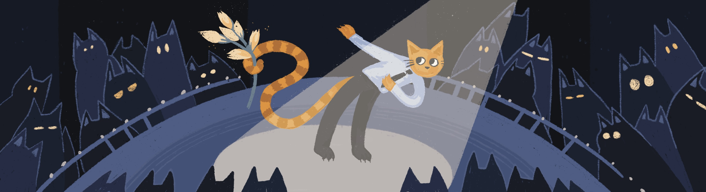

# Use Cases

Summary:
In this project, we'll discuss use cases, a common way of describing requirements for systems that contain models of software system behavior or ways for users to interact with the system.

💡 [Tap here](https://new.oprosso.net/p/4cb31ec3f47a4596bc758ea1861fb624) **to leave your feedback on the project**. It's anonymous and will help our team make your educational experience better. We recommend completing the survey immediately after the project.

## Contents

1. [Chapter I](#chapter-i) \
   1.1. [Preamble](#11)
2. [Chapter II](#chapter-ii) \
   2.1. [General Rules](#21)
3. [Chapter III](#chapter-iii) \
   3.1. [Use Cases](#31) \
   3.2. [Recommendations](#32) \
   3.3. [Use Cases Links](#33)
4. [Chapter IV](#chapter-iv) \
   4.1. [Task 1. Haircut Appointment](#41) \
   4.2. [Task 2. Delivery of Orders](#42) \
   4.3. [Task 3. Warehouse Storage](#43)
5. [Chapter V](#chapter-v) \
   5.1. [Exercise 00 — Description of Use Cases](#51) \
   5.2. [Exercise 01 — Description of Use Case Flows](#52) \
   5.3. [Exercise 02 — Description of Use Cases](#53) \
   5.4. [Exercise 03 — Description of Use Case Flows](#54) \
   5.5. [Exercise 04 — Description of Use Cases](#55) \
   5.6. [Exercise 05 — Description of Use Case Flows](#56)

## Chapter I 

### Preamble 

The use case shows the agreements of the participants in the system about its behavior in response to the requests of the actors under different conditions. At the same time, the use case is aimed at achieving the goal of the main actor and satisfying the interests of other participants in the process.

### Literature:

1. Alistair Coburn "Writing Effective Use Cases".
2. Martin Fowler "UML Distilled", Third Edition.
3. Karl Wiegers, Joy Beatty, "Software Requirements" 3rd edition, amplified.
4. BABOK v3 "A Guide to the Business Analysis Body of Knowledge" IIBA.
5. Dean Leffingwell, Don Widrig "Managing Software Requirements".

## Chapter II 

### General Rules 

1. Along the way, you may feel a sense of uncertainty and a severe lack of information: that's OK. Remember, the information in the repository and on Google is always with you. So are your peers and RocketChat. Communicate. Search. Use common sense. Don't be afraid to make mistakes.
2. Pay attention to sources of information. Check. Think. Analyse. Compare. 
3. Look at the text of each assignment. Read it several times. 
4. Read the examples carefully. There may be something in them that is not explicitly stated in the task itself.
5. You may find inconsistencies where something new in the terms of the task or examples conflicts with something you already know. If you come across such an inconsistency, try to work it out. If not, write it down as an open question and find out as you work. Do not leave open questions unanswered. 
6. If a task seems confusing or impossible, it only seems that way. Try to break it down. It is likely that some parts will become clear. 
7. There will be several tasks. Those marked with an asterisk (\*) are for the more meticulous students. These tasks are more difficult and are not compulsory. But doing them will give you extra experience and knowledge.
8. Don't try to fool the system or the people around you. You will fool yourself first.
9. Got a question? Ask your neighbour to the right. If that doesn't help, ask your neighbour on the left.
10. When you use help, you should always understand why and how. Otherwise the help is useless.
11. Always push only to the develop branch! The master branch will be ignored. Work in the src directory.
12. There should be no files in your directory other than those specified in the tasks.

## Chapter III 

### 1. Use Cases 

**Use Case** is a description of how stakeholders interact with the system. 

The main thing to understand is not WHAT one wants to do when interacting with the system, but WHY, with WHAT PURPOSE. 

Use case allows you to discuss and agree on the behavior of the system during the interaction. It can be represented as:

- narrative textual description;
- structured text;
- a table of a certain structure;
- use case diagram.

Use case is a description of a case, a branch of interaction.  Use cases are a set of scenarios under different conditions.

***Use Case Description***\
*Header:*\
The header should have a unique title. Usually a verb (indicating the action to be performed by the participant) + a noun (describing what is being done) or the purpose of the action.

*Actors*

- *An Actor*: an external party that interacts with the system. An actor can be a generalized person, a group of people (a role), or another system. Some approaches discourage the use of systems as actors.
- *Primary actor*: a stakeholder who derives business value from the interaction and is the initiator of the interaction. Does not necessarily participate in the interaction themselves. 
- *Stakeholder*: anyone with an interest in interacting with the system. The use case should take into account the interests of the stakeholders.
You can read more about the participants and primary actors in Chapter 4 "Stakeholders and Actors" of Alistair Coburn's book "Writing Effective Use Cases".

*Goal*\
Business need of the primary actor. A brief description of the use case's outcome from the primary actor's point of view in domain terms, not technical terms.

*Scope*\
Can be seen as:

- black box — only external human and system actions are described;
- semi-transparent box — it is generally clear what happens inside the system when interacting, but without technical details;
- transparent box — the details of what happens inside the system when interacting are clear.

*Preconditions*\
One or more conditions that must be true before the use case is executed. The precondition is checked before the use case starts, it is not part of the use case.

*Trigger*\
The event which triggers the use case. It can be an action of a participant, a time event, a change of state of an object, etc. The trigger can be the first step of the use case or can precede the use case.

*Postconditions (guarantees)*\
A condition that must be true at the end of a use case. The postcondition must be true for both base and alternative flows. The use case can describe postconditions separately for each flow. 

*Minimal Guarantees* describe conditions that must be true for both successful and unsuccessful completion of a use case (even if the primary actor's goal is not achieved). 

*Success Guarantees* describe the postconditions for a successful outcome.

More details about the stakeholders and primary actors can be found in Chapter 6 "Preconditions, Triggers, Guarantees" of Alistair Coburn's book "Writing Effective Use Cases".

*Event Flow*

A sequence of steps taken by an actor and a decision made during the execution of a use case. There are basic, alternative, and exception flows.

The *basic flow* (main, successful, primary scenario) is the shortest or easiest way to achieve the primary actor's goal. The steps of the main flow should be numbered in a single sequential numbering. 

The *alternative flow* describes other possible paths that may or may not allow the actor to successfully achieve the use case goal. The steps of each alternative flow should be numbered in a single numbering, branching from the corresponding step of the base flow. 

The *exception flow* describes the behavior of the system when the goal is unattainable and the use case cannot be successfully completed. The exception steps should also be numbered similarly to the alternative flow steps.

*Additional parameters*

References to other descriptions: user interface, business rules, data processing algorithms, non-functional requirements, etc.  

You can read more about event flows and use case steps in Chapter 7 "Scenarios and Steps" of Alistair Coburn's book "Writing Effective Use Cases".

### 2. Recommendations 

There is no universal format for use cases. Typically, teams choose one or another best practice that reduces errors. Here are some common recommendations.

1. ***Use case is a description of functional interaction.*** Describe the use case in business terms, without technical details.
2. Limit the boundaries of use case to achieve the goal, but don't fragment it. Use case is not a single step. 
3. Use ***simple sentences***. For each step, indicate ***who performs the action:*** the stakeholder (role) or the system. Example sentence structure: <subject> <causative> <indirect complement> <prepositional phrase>, for example: The system authenticates the name and password.
4. Collect in one step **all data transmitted in one direction**. For example, transmit full name and other personal information in one step.
5. Apply "The system confirms..." instead of "The system checks...".  
6. Reduce complex ***interactions to a 4-step*** transaction, e.g: 
   1) Stakeholder enters a request and submits data;
   2) The system checks (confirms) ....;
   3) The system modifies ...;
   4) The system produces a result. 
7. When numbering steps, follow the rules:
   1) the steps of the basic flow should be numbered in simple numbering;
   2) the steps of the alternative flow should be numbered in their simple numbering, but with reference to the step of the basic flow from which there is a deviation. It is convenient to use numeric-letter numbering. An example is given below.
8. It is recommended that user interface, non-functional requirements, business rules should not be written directly in the use case, but described separately and referenced in the use case in the Extras field.
9. Keep the use case at the same level throughout its description, do not overload it with unnecessary details.

**Example**: *Use Case "Buy stocks over the web"*.

*Precondition:* User already has PAF open.

*Trigger:* User selects stocks.

*Main scenario:*

1. User selects to buy stocks over the web.
2. PAF gets name of web site to use (Schwab, etc.) from user.
3. PAF opens web connection to the site, retaining control.
4. User browses and buys stock from the web site.
5. PAF intercepts responses from the web site, and updates the user's portfolio.
6. PAF shows the user the new portfolio standing.

*Result* (success guarantee): The user bought the securities.

*Alternative scenario:*

1. Network failure of any kind while connected to the site:
   1. System reports failure to user with advice, backs up to previous step;
   2. User either backs out of this use case, or tries again.

### 3. Use Case Relationships 

Sometimes some common functionality is needed by multiple use cases or to identify a complex part. For example, pricing and risk analysis (see figure below) use the same value calculation. In this case, it is better to describe the common part of the use case separately and include it in each use case where it is applied. This relationship is called *include*. The included use case does not need to be complete in itself, unless it is directly initiated by the actor. 

Another type of relationship, *extend*, allows you to add a description of additional functionality to a use case. The extending use case must itself be fully functional. Its successful execution should not depend on the extending use case. An alternative scenario can be shown with an extension.

## Chapter IV 

### Description of tasks

### Task 1. Haircut Appointment 

The management of a chain of barbershops decided to implement an online booking system. The main objective is to develop the business by expanding the customer base through the possibility of online registration, as well as to reduce employee labour costs and manual labour by automatically informing customers through communication channels. 

Both registered and unregistered visitors can book an appointment on the website. When making an appointment, they can select the type of service: hairdressing or cosmetology, as well as the service itself, the master and the time from the available intervals. The system should provide automatic sending of reminders to clients through the communication channel chosen by the client (Telegram, WhatsApp, VK, SMS) according to the schedule set by the manager. After receiving a service, the system offers the client to evaluate the service and write suggestions on how to improve the work.

The schedule of masters and the services provided by each master should be entered by the manager, who may be more than one person. This person is also responsible for keeping the schedule up to date and adjusting it if necessary, communicating with customers manually, marking the service, charging and accepting payment, sending the payment data to the accounting department. The manager can also receive reports on completed services and view customer feedback.

Each master has the ability to view the schedule and appointments for their services, as well as customer reviews. 

### Task 2. Delivery of Orders 

During the lockdown, many grocery stores and food companies dramatically increased their online sales and the need for quick delivery of small quantities to individual customers increased. 

A group of students got together and decided to create a delivery service startup. The idea is to quickly receive information about orders, pickup location and time, delivery location, desired delivery dates, and distribute this information to couriers who will pick up the order at the pickup location and deliver it to the delivery location. They decided to develop an online system where orders could be collected and quickly sorted for delivery by couriers.

The first step was to collect orders from stores and caterers in any way possible and have the operator enter them into the system in a consistent format, as well as developing a mobile application for the courier. The courier should be able to view order information, select an order from those available, book it, pick it up at the collection point and deliver it to the customer. The result of the courier's actions should be immediately reflected in the system via a mobile application. The system should also include a dispatcher who controls the couriers and reassigns orders if necessary. Information on received orders should be sent to the accounting department (to another IT system) to calculate delivery charges with order suppliers. Order delivery information should also be sent to the accounting department to calculate payment to couriers. Accrued payment should be transferred to the system and displayed in the courier's personal account. And there should also be an administrator's workstation, where couriers are registered and access rights are assigned to all of them.

### Task 3. Warehouse Storage 

A logistics company engaged in cargo transportation has decided to expand its business and organize the lease of warehouses for temporary or permanent storage of things and goods for individuals and legal entities. It is planned to rent and build warehouses in different parts of the city. The first: "Kamorka" — a system in the company, which provides accounting of rent of individual boxes of size from 3 to 15 square meters by individuals for storage of personal belongings, furniture, sports equipment.

The management of the company (customer) decided to introduce a centralized rental accounting of boxes, occupied and vacant, payment, access control and cleaning after vacating. Access to the warehouse itself is provided by a third party security company, which needs to be informed about new or dropped customers. The security company issues an electronic pass to the storage area for the specified period of time, extends or stops the validity of the pass in case of renewal or early termination of the lease agreement. The boxes are cleaned by the cleaning company after their use and before they are handed over to a new client. The purpose of the system implementation is to reduce manual work and personnel costs, reduce overhead costs, optimize box filling (minimize idle time of empty boxes), operational accounting of cash flow.

The client (individual) contacts the logistics company and through the manager concludes a contract for renting a box of the required size. To do this, the manager must have up-to-date information about available and soon-to-be vacant boxes. The client does not interact directly with the system, all information is provided by the manager. When the contract expires, the manager warns the client of the need to renew or terminate the contract and vacate the box. The manager is also responsible for organizing the cleaning of the boxes by a third-party company after they are vacated, as well as for organizing the client's access to the storage area, which is provided by a security company. After signing the contract, the manager informs the storekeeper about the allocation of a particular vacant box. The storekeeper checks the availability of the box (release of the previous tenant's belongings and cleaning), hands over the key to the box to the client, controls the release and cleaning of the boxes.

The team has an accountant. He/she calculates payments and controls income, payments to clients, payments for cleaning of boxes and security of the warehouse. The accountant receives information about new contracts and their changes from the manager. The payment for the cleaning of the boxes is calculated monthly on the basis of the area, the payment for the security — also monthly on the basis of the number of clients of the logistics company.

## Chapter V 

### Exercise 00 — Description of Use Cases 

For Task 1, use the Use Case form to describe the interaction with the system to ensure that the system contains the actual schedule of master services without taking into account occupied and free slots. 

1. Apply the conditions of the task. In case of uncertainty, it is acceptable to add an additional condition by specifying it in the "Assumptions" section.
2. Identify the main actor whose business goal the system is supposed to solve in the use case and who is the initiator of the interaction with the system. 
3. Describe the purpose of the use case: the business need of the main actor, the business goal to be solved by the system using the use case.  
4. Provide a unique identifier for the use case.
5. Provide the name of the use case, a short unique title that describes the main action or purpose of the action in the format: <verb> + <noun> + <complement>. 
6. Identify the role of the Actor interacting with the system within the use case and their interest (need).
7. Identify at least 2 other stakeholders for whom the outcome of the use case is important. Identify their interests.
8. Specify the precondition of the use case: one or more conditions that must be true before the use case is executed. If there is no precondition, specify its absence.
9. Specify the use case trigger: the event that triggers the use case (action, temporary event, state change).
10. Specify the postconditions (conditions that must be true when the use case is completed):
    1. minimal guarantees: conditions that must be true at each end of the use case;
    2. success guarantees: conditions that must be true when a use case succeeds. 
11. Indicate your answers in the file `ex00_<product prefix>_US.docx`.

### Exercise 01 — Description of Use Case Flows 

For Task 1, use the Use Case form to describe the functional interaction for providing the actual schedule of master services in the system (without taking into account occupied and free slots) (Use Case described in ex.00).

1. When describing flows, use simple short sentences in the format: <*stakeholder or system*> <action to be performed> <conditions and/or constraints> *(subject — predicate — complements)*.
2. Use business rather than technical terms to describe steps.
3. All data transferred in a single time interval from a single source in a single direction should be transferred in a single step. 
4. Maintain the use case level in all its description up to the 5th level of nesting or implement an extension — another use case.
5. Minimize branching: use "The system confirms..." instead of "The system checks...". (To avoid writing "If... then...").
6. Reduce complex interactions to e.g. 4 transaction steps:
   1. The stakeholder enters the request, transfers the data;
   2. The system confirms the correctness of the input;
   3. The system modifies ....;
   4. The system outputs the result ...
7. If there are additional materials (user interface descriptions, prototypes, business rules, etc.) — place them separately from the use case, specify them with a link in the Additional field.
8. Describe the main scenario of the use case, using a numerical numbering of steps.
9. Number alternative scenarios with letters in relation to the step of the main scenario.
10. Alternate scenario steps should be numbered with:
    1. the step number of the main scenario;
    2. the letter of the branch from the main scenario step (alternate scenario letter);
    3. the step number within the alternate scenario.
11. Indicate your answers in the file `ex01_<product prefix>_US.docx`.

### Exercise 02 — Description of Use Cases 

For Task 1, use the Use Case form to describe how the client interacts with the system to select master services and book the selected slots.

1. Describe the use cases as required in 1-11 ex.00.
Identify one or more separate use case(s) with an "include" or "extend" relationship.  
3. Specify the type of relationship for each identified use case.
4. Indicate your answers in the file e`x02_<product prefix>_US.docx`.

### Exercise 03 — Description of Use Case Flows 

For Task 1, describe the basic flow and alternative flows of functional interaction between the client and the system to select a service and book a slot. 

1. Describe the flows of the use case(s) as required in 1-11 ex.01.
2. Describe the flows of the identified use case(s).  
3. Indicate your answers in the file `ex03_<product prefix>_US.docx`.

### Exercise 04 — Description of Use Cases 

For Task 1, use the Use Case form to describe the Master's interaction with the system in terms of viewing clients' booked services, their schedules, and clients' feedback on the work. 

1. Describe the use cases as required in 1-11 ex.00.
2. Identify a separate use case(s), with an "include" or "extend" relationship. 
3. Specify the type of relationship for each identified use case.
4. Indicate your answers in the file `ex04_<product prefix>_US.docx`.

### Exercise 05 — Description of Use Case Flows 

For Task 1, describe the basic flow and alternative flows of functional interaction between the master and the system to view services booked by clients and client feedback on the work. 

1. Describe the flows of the use case(s) as required in 1-11 ex.01.
2. Describe the flows of the identified use case(s). 
3. Indicate your answers in the file `ex05_<product prefix>_US.docx`.
